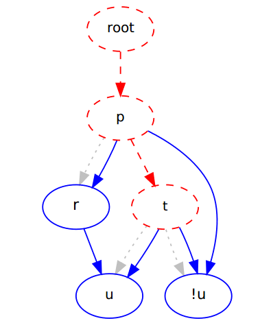

SatSolverProject
================

How to run the solver?
----------------------

The command line interface is almost unchanged from the project template.
To compile the project, just run
```
sbt compile
```
in the project folder.

To then run the solver on a specific formula file, use :
```
// just run a single .smt2 file
sbt "run path-to-file/filename.smt2"

// run a file in .cnf format
sbt "run /cnf path-to-file/filename.cnf"

// choose which algorithm to use
sbt "run path-to-file/filename.smt2 /dp"
sbt "run path-to-file/filename.smt2 /dpll"
sbt "run path-to-file/filename.smt2 /cdcl"

// run all an algorithm on a file with timeout and print the runtime
sbt "run /eval path-to-file/file /[dp|dpll|cdcl]"

For the automatic evaluation it is not necessary to add the `/cnf` flag, it will
work with both formats. Specifics about running the evaluation can be configured
directly in the `AlgorithmEvaluator` class, using the `nRuns` and `maxRuntime`
constants.

For solving sudoku puzzles:
```
// solve a sudoku puzzle
sbt "run path-to-file/sudoku-puzzle.txt /sudoku"
// solve sudoku puzzel with specific solver (the default sovler is dpll)
sbt "run path-to-file/sudoku-puzzle.txt /cdcl /sudoku"
```

How to run the tests?
---------------------

Some of the tests use the z3 solver. If it is not installed, the tests will
just fail. On Ubuntu for instance this is as simple as:
```
sudo apt-get install z3
```

The test can be run by invoking sbt in the SatSolverProject folder:
```
cd SatSolverProject
sbt test
```

How to debug CDCL?
------------------

To visualize what's going on in CDCL use the GraphVisualizer. In order to turn
it on switch the ```writeDotGraph``` flag in CDCLSolver. Then open the
generated tmp.dot file in a dot viewer such as xdot.




Analysis
--------

You can find the evaluations and our analysis of the results in the subfolder
[./result](./result).

