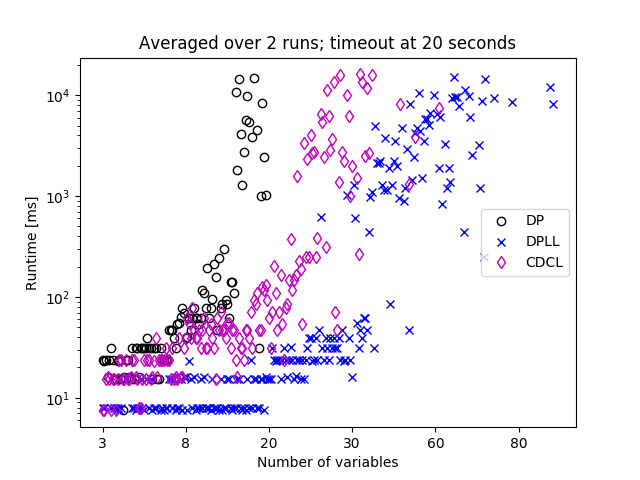
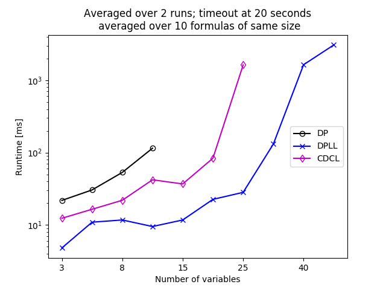
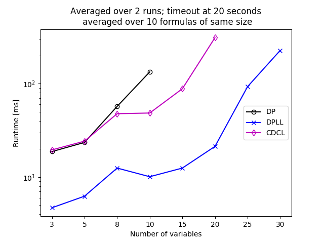
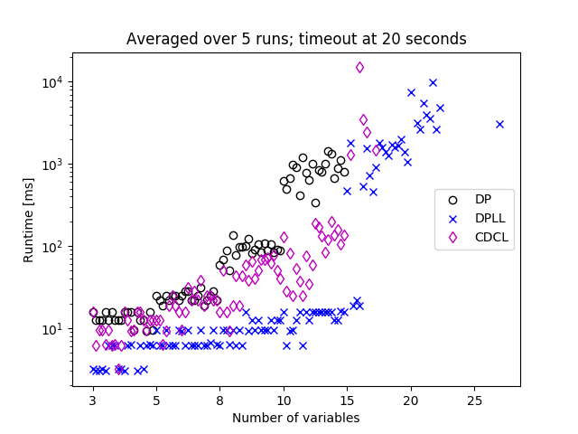

# Result

We evaluated the three SAT solving algorithms in three different ways. One was
using our own formula generator. Then we tried some combinatorial problems from
a SAT competition, as well as some application problems.

## Randomly Generated Formulas

We generated formulas in 3sat and 5sat, meaning each clause has at most 3 or 5
literals respectively. In each of those categories, we used formulas with
increasing numbers of variables and clauses. For each of these tuples
(#variables, #clauses) we generated 10 formulas which are satisfiable and 10
which are unsat. We will now look at the results in more detail.

### 3sat

For 3sat the set of the number of variables we used was
\[3,5,8,10,15,20,25,30,40,50,60,70,80,90,100,120\]. The number of clauses increase
accordingly. So for each of those values we generated 10 satisfiable and 10
unsatisfiable formulas, giving a total number of 320 formulas. We let each
algorithm run twice on each formula, to then average the runtime. We set a
timeout of 20 seconds, so if an algorithm took longer than that, we cancelled
it and would record it as failed (those will just be missing entries in the
graph). The reason we used this rather small limit, is that even so running all
the formulas took a standard quadcore desktop computer around 8 hours.

The following graph shows the result of the experiments:

The x axis shows the number of variables of the formula, the y axis the runtime
in milliseconds on a logarithmic scale. Note that the x axis is not a linear
scale, but rather staying at a value for 20 runs, then jumping to the next
number of variables.

The first thing we notice, is that all algorithms show an exponential increase
of the runtime with increasing number of variables. Surprisingly DPLL performs
significantly better than CDCL. We assume this is because we are still dealing
with rather small numbers of variables, so the overhead of maintaining the graph
is quite high. The algorithmic advantage would probably show up on larger
formulas, but the general performance of our solver can't handle those in
reasonable timeframes.
Another reason might be that since we are dealing with random formulas here,
the advantage of clause learning is very small.
Also we should mention that in DPLL whenever we have to make a decision on which
literal to branch off, we pick the one which appears most often in the formula.
This is a rather simple heuristic, but might still bring a large advantage over
CDCL, where we just pick the first occurring one. The reasoning was that with
learning we would converge quickly anyway, but this seems not to cancel out.

DP can keep up to formulas with around 20 variables and 90 clauses before
going over the 20 second limit. CDCL goes up to about 50, DPLL to 80.

For the next two graphs, we seperated the satisfiable from the unsatisfiable
formulas, and only look at the average runtime over the ten formulas of same
size. We required all ten formulas to have completed in under 20 seconds to
appear on the graph.

 | 
---|---
only sat formulas | only unsat formulas

We can see that in general unsat problems are harder, as we can handle fewer
variables within the 20 second limit. This is because we can stop the search as
soon as we find a valid assignment in sat problems, but in unsat we have to
explore more.

Other than that we can see that on unsat problems, CDCL seems to lose its
advantage over DP. This is because ???Jan???.

### 5sat

For 5sat we used the same set of number of variables, but only went up to 50
(\[3,5,8,10,15,20,25,30,40,50\]). Since there are fewer formulas to test, we
averaged each formula over 5 runs, while keeping the timeout at 20 seconds.

Here are the results:

We see a very similar picture as for 3sat, but now we cut out even sooner, at
about 25 formulas for DPLL and only 15 for DP and CDCL. This is not only because
we increased the number of literals per clause, but also because we used a
larger factor to map the number of variables to number of clauses.

The results when we separate the sat from the unsat problems and average over
same sized formulas as before, look very much the same as for 3sat. We therefore
omit the graphs here, you can find them in the folder.

## Combinatorial

In addition to running our own generated formulas, we had a go at some
combinatorial problems from a SAT competition
([satcompetition.org](http:/www.satcompetition.org)). We quickly realized that
those problems are way too hard for our rather simplistic implementations.

We took one of the smallest formula we could find, which had 275 variables and
around 1000 clauses. When later investigating it a bit closer, we realized that
each clause had eight variables, and they were distributed in a way that the
standard implementations of ours pretty much had to try every single possible
variable assignment. So we would have to check 2275 possible
assignments or approximately 1082. Assuming we could check one
assignment every nanosecond, that would leave us with 1073 seconds of
runtime. This would be too much for the projects deadline, considering that our
universe is around 1018 seconds old. Clearly this kind of problem
requires a smarter approach.

## Application

In order to get some more realistic problems to test our solver with, we took
some benchmarks from the
[SATLIB - Benchmark Problems](http://www.cs.ubc.ca/~hoos/SATLIB/benchm.html).
From the subsection "DIMACS Benchmark Instances" we picked two categories:
-   parity - 20 formulas, all satisfiable
-   inductive inference - 41 formulas, all satisfiable

Both categories include formulas of increasing size. We had trouble running even
the smallest instances of those problems. We ran the experiments with a timeout
of ten seconds.

In case of parity we managed to solve 8 out of the 10 smallest
instances using DPLL with an average runtime of 1.5 seconds. Both DP and CDCL
didn't manage to solve a single one.

For the inductive inference problems it looks even worse. We solved the smallest
instance with DPLL in about 250ms, with CDCL in about 400ms on average. No other
instances were solved within the timeout.

## Conclusion

We found that CDCL is significantly slower than DPLL on our test cases. We
mentioned a couple of reasons why this could be, but the result is still
surprising.

Less surprising is that DP can't keep up with either of the other two
algorithms. We noticed when testing with longer timeouts, that on slightly large
formulas DP will fail because it runs out of memory. In testing it took around
six minutes until it filled all the four gigabytes of the JVM.

All in all the performance of our SAT solver is pretty underwhelming. We didn't
do much in the way of optimizing performance. We don't use any smart heuristics
for quicker convergence, and the scala implementation is designed more to be
readable and correct, rather than optimized for performance.
