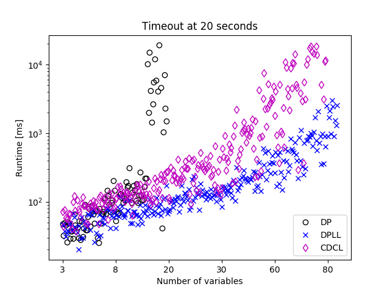
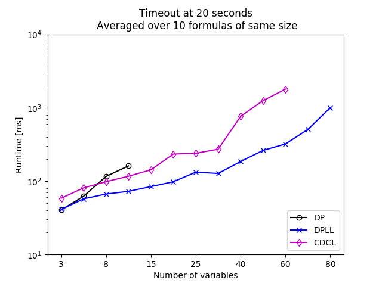
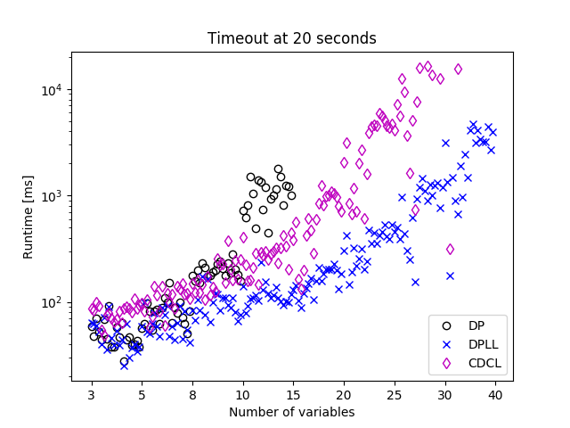

# Result

We evaluated the three SAT solving algorithms in three different ways. One was
using our own formula generator. Then we tried some combinatorial problems from
a SAT competition, as well as some application problems.

## Randomly Generated Formulas

We generated formulas in 3sat and 5sat, meaning each clause has at most 3 or 5
literals respectively. In each of those categories, we used formulas with
increasing numbers of variables. We picked the number of clauses given the
chosen number of variables such that both satisfiable and unsatisfiable
formulas can be generated (for more details see
```PerformanceTestCNFGenerator.scala```). For each of these tuples (#variables,
#clauses) we generated 10 formulas which are satisfiable and 10
which are unsat. We will now look at the results in more detail.

### 3sat

For 3sat the set of the number of variables we used was
\[3,5,8,10,15,20,25,30,40,50,60,70,80\]. The number of clauses increase
accordingly. So for each of those values we generated 10 satisfiable and 10
unsatisfiable formulas, giving a total number of 260 formulas. We then let every
algorithm run on each formula. We set a timeout of 20 seconds, so if an
algorithm took longer than that, we cancelled it and would record it as failed
(those will just be missing entries in the graph). The reason we used this
rather small limit, is that even with the small limit running all the formulas
took a standard quadcore desktop computer around 4 hours.

The following graph shows the result of the experiments:



The x axis shows the number of variables of the formula, the y axis the runtime
in milliseconds on a logarithmic scale. Note that the x axis is not a linear
scale, but rather staying at a value for 20 runs, before jumping to the next
number of variables.

The first thing we notice, is that all algorithms show an exponential increase
of the runtime with increasing number of variables. Surprisingly DPLL performs
significantly better than CDCL. This is probably because of the way we
implemented CDCL. We represent the graph as an object graph and the algorithm
has to traverse the graph many times. As we increase the number of variables
and clauses, the graph gets a lot larger and therefore our CDCL implementation
spends more time with traversing the graph. There are probably smarter ways on
how to encode the graph for this particular task. We chose an object graph
implementation because it was easy to debug and work with. We for instanced
used our ```GraphVisualizer``` when debugging CDCL.

Another reason might be that since we are dealing with random formulas here,
the advantage of clause learning is very small because there is no inherent
structure in the problem.

We should mention that in DPLL aswell as CDCL whenever we have to make a
decision on which literal to branch off or pick next, we pick the one which
appears most often in the formula. This is a rather simple heuristic, but
worked better than for instance just picking the first one.

DP can keep up to formulas with around 20 variables and 90 clauses before
going over the 20 second limit.

For the next two graphs, we seperated the satisfiable from the unsatisfiable
formulas, and only look at the average runtime over the ten formulas of same
size. We required all ten formulas to have completed in under 20 seconds to
appear on the graph.

 | 
---|---
only sat formulas | only unsat formulas

We can see that in general unsat problems are harder, the average runtime is
quite a bit higher. This is because we can stop the search as soon as we find a
valid assignment in sat problems, but in unsat we have to explore more.

### 5sat

For 5sat we used the same set of number of variables, but only went up to 30
(\[3,5,8,10,15,20,25,30\]). We again used a timeout of 20 seconds.

Here are the results:



We see a very similar picture as for 3sat, but now for instance DP can only
solve formulas with up to 15 variables within the given time limit. This is not
only because we increased the number of literals per clause, but also because
we added more clauses such that we could generate both sat and unsat formulas.

The results when we separate the sat from the unsat problems and average over
same sized formulas as before, look very much the same as for 3sat. We therefore
omit the graphs here, they can be found in the folder.

## Combinatorial

In addition to running our own generated formulas, we had a go at some
combinatorial problems from a SAT competition
([satcompetition.org](http:/www.satcompetition.org)). We quickly realized that
those problems are way too hard for our rather simplistic implementations.

We took one of the smallest formula we could find, which had 275 variables and
around 1000 clauses. When later investigating it a bit closer, we realized that
each clause had eight variables, and they were distributed in a way that the
standard implementations of ours pretty much had to try every single possible
variable assignment (at least for DPLL). So we would have to check
2<sup>275</sup> possible assignments or approximately 10<sup>82</sup>. Assuming
we could check one assignment every nanosecond, that would leave us with
10<sup>73</sup> seconds of runtime. This would be too much for the projects
deadline, considering that our universe is around 10<sup>18</sup> seconds old.
Clearly this kind of problem requires a more optimized implementation.

## Application

In order to get some more realistic problems to test our solver with, we took
some benchmarks from the
[SATLIB - Benchmark Problems](http://www.cs.ubc.ca/~hoos/SATLIB/benchm.html).
From the subsection "DIMACS Benchmark Instances" we picked two categories:
-   parity - 20 formulas, all satisfiable
-   inductive inference - 41 formulas, all satisfiable

Both categories include formulas of increasing size. We had trouble running even
the smallest instances of those problems. We ran the experiments with a timeout
of ten seconds.

In case of parity we managed to solve the 10 smallest instances using DPLL with
an average runtime of 0.7 seconds. With CDCL we could solve 7 out of the 10
smallest instances with an average runtime of 2.56 seconds. DP didn't manage to
solve a single one. The concrete numbers are in the table below.

file | DPLL runtime [ms] | CDCL runtime [ms]
---|---|---
application_tests/parity/par8-1.cnf | 1147 | -
application_tests/parity/par8-1-c.cnf | 281 | 1361
application_tests/parity/par8-2.cnf | 999 | -
application_tests/parity/par8-2-c.cnf | 391 | 3253
application_tests/parity/par8-3-c.cnf | 550 | 1054
application_tests/parity/par8-3.cnf | 863 | 8132
application_tests/parity/par8-4.cnf | 1393 | -
application_tests/parity/par8-4-c.cnf | 332 | 1573
application_tests/parity/par8-5.cnf | 867 | 2090
application_tests/parity/par8-5-c.cnf | 220 | 451

For the inductive inference problems it looks a bit more interesting. We were
now able to solve more problems within the timeout with our CDCL implementation
than with our DPLL implementation. There were cases where DPLL was able to
solve the problem and CDCL wasn't but also the other way around. The numbers are
in the table below.

file | DPLL runtime [ms] | CDCL runtime [ms]
---|---|---
application_tests/inductive_inference/ii8b2.cnf | - | 7255
application_tests/inductive_inference/ii8a1.cnf | 162 | 208
application_tests/inductive_inference/ii8b3.cnf | - | 5180
application_tests/inductive_inference/ii8a3.cnf | - | 7609
application_tests/inductive_inference/ii32c1.cnf | - | 1235
application_tests/inductive_inference/ii32b1.cnf | 3470 | -
application_tests/inductive_inference/ii32e1.cnf | 4090 | 1024
application_tests/inductive_inference/ii8a2.cnf | - | 1550

These results probably mean that the problems now had a structure that our CDCL
solver could exploit and solve them even though our implementation is not really
runtime optimized as the previous results showed.

## Sudoku Solving

We implemented a sudoku solver by using the minimal encoding described
[here](https://pdfs.semanticscholar.org/3d74/f5201b30772620015b8e13f4da68ea559dfe.pdf).
Both our DPLL solver and our CDCL solver are able to solve the formulas in a
reasonable amount of time (tens of seconds) except for some hard cases where
the CDCL solver needs minutes to solve the formula (for instance
[evil3.txt](../SatSolverProject/src/test/resources/sudoku/evil2.txt)).
Again our DPLL solver is faster than our CDCL solver in the average case.

## Conclusion

We found out that our CDCL implementation is significantly slower than our DPLL
implementation on some of our test cases. We mentioned a couple of reasons why
this could be, but the result is still surprising.

Less surprising is that DP can't keep up with either of the other two
algorithms. We noticed when testing with longer timeouts, that on slightly large
formulas DP will fail because it runs out of memory. In testing it took around
six minutes until it filled all the four gigabytes of memory of the JVM.

All in all the performance of our SAT solver is pretty underwhelming. We didn't
do much in the way of optimizing performance. We don't use any smart heuristics
for quicker convergence, and our Scala implementation is designed more to be
readable and correct, rather than optimized for performance.
